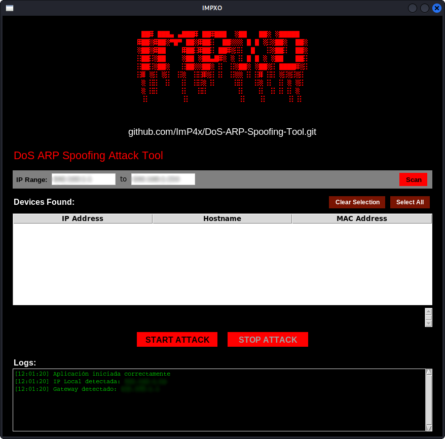
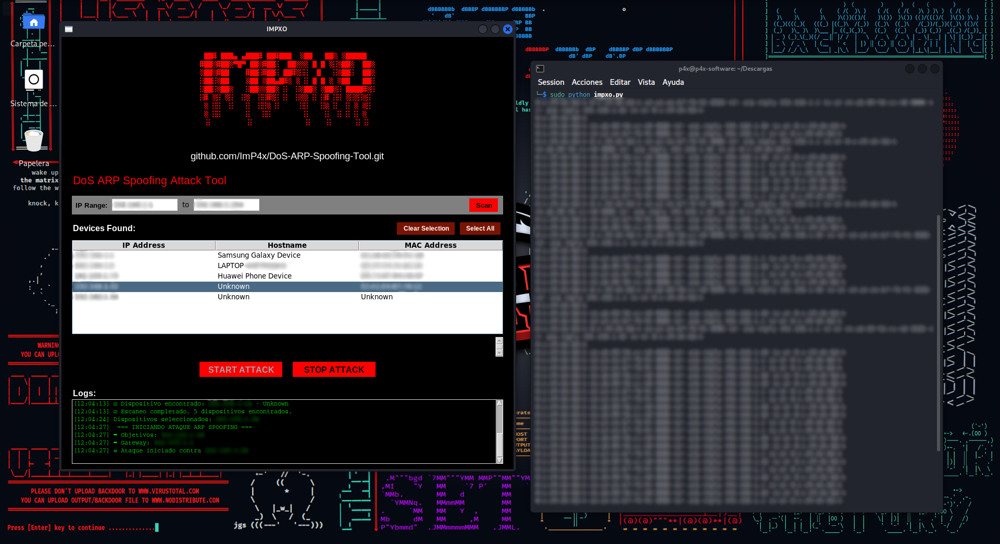

# DoS ARP Spoofing Tool - IMPXO
[](https://www.python.org/downloads/release/python-3922/) 
 
[](https://github.com/OxDEAD0DE/fsociety/blob/main/LICENSE)
## Overview

IMPXO is a comprehensive network analysis and ARP spoofing tool with a user-friendly graphical interface. It allows network administrators and security researchers to:

- **Network Discovery**: Scan and identify devices on local networks
- **Device Information**: Display IP addresses, hostnames, and MAC addresses  
- **ARP Spoofing**: Perform controlled network isolation attacks
- **Connection Management**: Start and stop attacks with immediate restoration capabilities

## 🛠️ Technical Stack

| Component           | Technology                   |
|---------------------|-----------------------------|
| **Language**        | Python 3.9+                 |
| **GUI Framework**   | Tkinter                     |
| **Network Tools**   | arpspoof, arping, ping, arp (Linux) / Scapy, Nmap, Npcap (Windows) |

# Installation

## Linux (Kali, Debian based)

```bash
# Dependencies Installation
sudo apt update
sudo apt install dsniff arping samba-common-bin snmp-tools
# Start
git clone https://github.com/ImP4x/DoS-ARP-Spoofing-Tool.git
cd DoS-ARP-Spoofing-Tool
cd Linux
sudo python impxo.py
```
## Windows (10/11)
### Requirements
1. Install [Nmap](https://nmap.org/download.html#windows)
URL Direct: [nmap-7.98-setup.exe](https://nmap.org/dist/nmap-7.98-setup.exe)

### Executable Version for Windows
This release contains the `impxo.exe` executable file ready for use on Windows 10/11, with all internal dependencies installed.
Download the file

# Note

`You can find the original Windows code in the repository if you want to check it out.`

## 📖 Usage Guide

1. **Launch Application**
```bash
# Linux
sudo python impxo.py
#Windows
Run `impxo.exe` as administrator
```

2. **Network Discovery**
- Click the **"Scan"** button to discover network devices
- Wait for the scan to complete

3. **Target Selection**
- **Single Selection**: Click on a device
- **Multiple Selection**: Ctrl + Click on devices
- **Select All**: Use the "Select All" button
- **Deselect All**: Use the "Deselect All" button

4. **Attack Control**
- **START ATTACK**: Begin ARP spoofing on selected targets
- **STOP ATTACK**: Immediately restore normal connections

# Screenshots
### Main


### Example


### Common Issues

**Permission Denied Error**
Ensure you're running with root privileges
```bash
sudo python impxo.py
```

**No Devices Found**
- Verify network connectivity (Wi-Fi/Ethernet)
- Check firewall settings
- Ensure proper network interface is active
- Try different IP ranges if needed

## Author

**ImP4x_O**
- GitHub: [@ImP4x](https://github.com/ImP4x)
- Year: 2025
